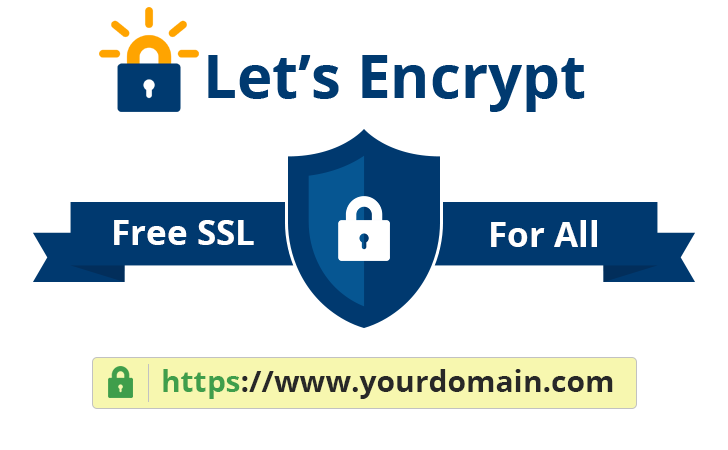
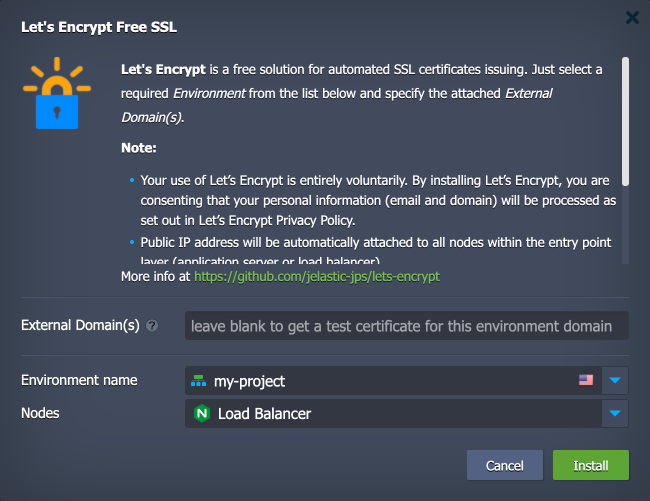
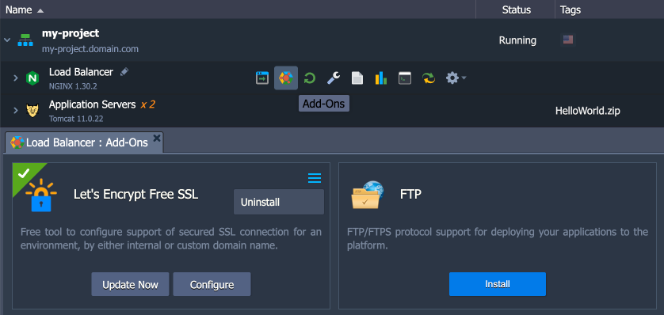

 

# Let’s Encrypt Add-On for Automated SSL Certificates Configuration

The **Let’s Encrypt SSL** add-on by Virtuozzo Application Management installs a certificate management agent (CMA) that automatically requests certificates from Let’s Encrypt, applies them to the stack’s SSL configuration, and renews them before expiry via a scheduled job.

**[Let’s Encrypt](https://letsencrypt.org/)** is a free and open Certificate Authority that simplifies and automates the issuance and deployment of browser-trusted SSL certificates.

 

> **NOTE:** You have the option to install the add-on Let’s Encrypt (a service provided by Internet Security Research Group, a California (United States) Nonprofit Public Benefit Corporation) to request a trusted certificate intended to publicly vouch that you control a certain domain name or names that are reachable on the Internet. As part of the process of proving that control, Let’s Encrypt will collect various information related to certificate authentication and management. That information includes the IP addresses from which you access the Let’s Encrypt service; all resolved IP addresses for any domain names requested; server information related to any validation requests; full logs of all inbound HTTP / ACME requests, all outbound validation requests; and information sent by or inferred from your client software.
> 
> Your use of Let’s Encrypt is entirely voluntary. By installing Let’s Encrypt, you are consenting that your information listed above will be processed as set out in [Let’s Encrypt Privacy Policy](https://letsencrypt.org/privacy/). If you do not wish your information to be processed by Let’s Encrypt, do not install the add-on, and if you choose to withdraw your consent after its installation, please communicate directly with Let’s Encrypt by contacting them as indicated in their Privacy Policy.

The installation can be performed on one of the following Virtuozzo Application Platform containers directly:

- **Load Balancers** - NGINX, Apache LB, HAProxy, Varnish
- **Java application servers** - Tomcat, TomEE, GlassFish, Payara, Jetty
- **PHP application servers** - Apache PHP, NGINX PHP
- **Ruby application servers** - Apache Ruby, NGINX Ruby

For other stacks, add a load balancer in front of the application servers and install the add-on on that layer. In clustered topologies, SSL termination at the load balancer is the default.

The Let’s Encrypt add-on allows you to configure SSL for:

- **Internal environment address**, which is composed of environment name and platform domain, to be served with a dummy (i.e., not commonly trusted) SSL certificate. This option can be used for testing purposes.
- **External domain(s)**, each of which must first be bound to the external IP of the environment's entry point node — see [Custom Domains](https://www.virtuozzo.com/application-management-docs/custom-domains/). Provides trusted SSL certificates for production applications.

To get deeper insights on how the Let’s Encrypt service works, refer to the [official documentation](https://letsencrypt.org/how-it-works/).

## Installation Process

To install the Let’s Encrypt add-on, you must be registered on one of the [Virtuozzo Application Management public cloud providers](https://www.virtuozzo.com/paas-partners/).

1\. Log in to your Virtuozzo Application Management dashboard. You can deploy this solution from the [Marketplace](https://www.virtuozzo.com/application-management-docs/marketplace/) or [import](https://www.virtuozzo.com/application-management-docs/environment-import/) a manifest file from this repository.

 

2\. In the opened installation window, specify the following details:

- provide **External Domain(s)** of the target environment; the possible options are:
  - leave the field blank to create a dummy SSL certificate assigned to the environment's internal URL (*env_name.[{hoster_domain}](https://www.virtuozzo.com/application-management-docs/hosting-providers/)*) for testing
  - enter previously linked external domain(s) to obtain a trusted certificate for each; when specifying multiple hostnames, separate them with a space, comma, or semicolon
- select the corresponding **Environment name** within the expandable drop-down list
- select a **Nodes layer** with your environment entry point (usually, it’s automatically detected and fetched by the add-on, but can be redefined manually)

3\. Finally, click **Install** and wait a few minutes while domain ownership is validated, Let’s Encrypt issues the certificate(s), and they are applied.

## Add-On Management

After the installation, you can manage the Let’s Encrypt add-on by clicking the **Add-Ons** icon next to the environment layer it was installed on.

 

The following actions are available:

- **Update Now** - renews the certificate(s) immediately. Let’s Encrypt SSL certificates are valid for 90 days and are automatically renewed 30 days before expiry.
- **Configure** - allows you to add or remove domains from the certificate(s). To avoid security issues, a new certificate is issued even when you only remove domain name(s) from the existing certificate.
- **Uninstall** - removes the add-on from the environment.

For additional information on how to renew or reconfigure SSL certificates using this add-on, follow the detailed [Let’s Encrypt SSL Certificates](https://www.virtuozzo.com/application-management-docs/lets-encrypt-ssl/) article. Take into account that the free and custom SSL certificates are provided for billing accounts only.
